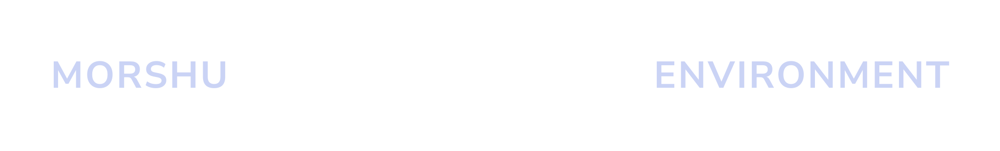
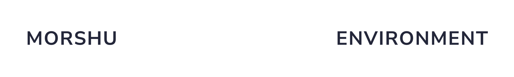

<p align='center'>
  <a href='https://www.github.com/morshul/mrsh#gh-dark-mode-only' target='_blank' rel='noopener noreferrer'>
    
  </a>
  <a href='https://www.github.com/morshul/mrsh#gh-light-mode-only' target='_blank' rel='noopener noreferrer'>
    
  </a>
</p>

A development environment configuration with a focus on modularity and automation.

# Objectives

This development environment configuration is intended to go beyond what you would normally expect from other configurations. This means that things like a framework for module development, linking automation, and more are in heavy development.

- Anyone can fork a repository to modify and implement their own modules.
- Allows the isolated development of modules through a solid test environment, which does not modify the operating system.

# Requirements

- A desktop platform running [Lua 5.4](https://www.lua.org/) or higher.
- When working with the codebase, we recommend using an editor with intellisense and syntax highlighting, such as [Visual Studio Code](https://code.visualstudio.com/) or [Neovim](https://neovim.io/).

## Installation

Download the [install script](../install) and run it.

```sh
# For Bash and ZSH
lua <(curl -sSL mrsh.morshu.me/install)

# For Fish
lua <(curl -sSL mrsh.morshu.me/install | psub)
```

# License

This repository is licensed under the [MIT License](https://opensource.org/licenses/MIT). Please see [the license file](../COPYING) for more information. [tl;dr](https://tldrlegal.com/license/mit-license) you can do whatever you want as long as you include the original copyright and license notice in any copy of the software/source.
